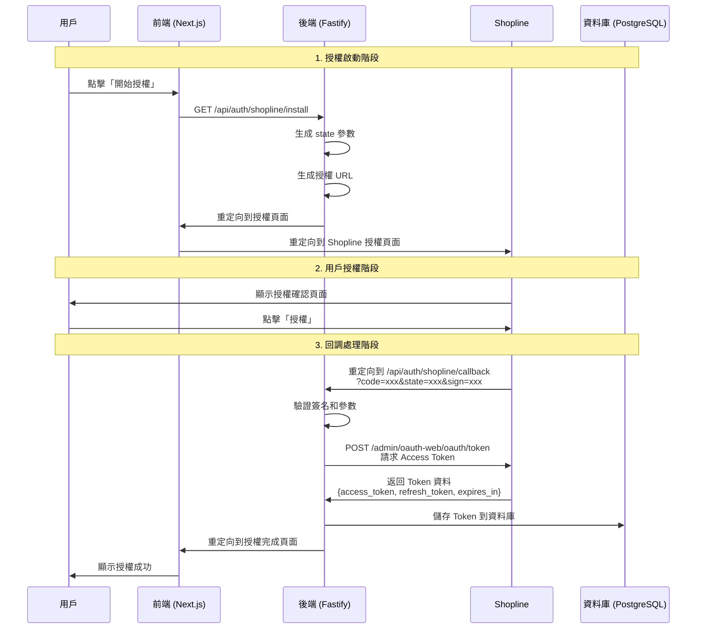
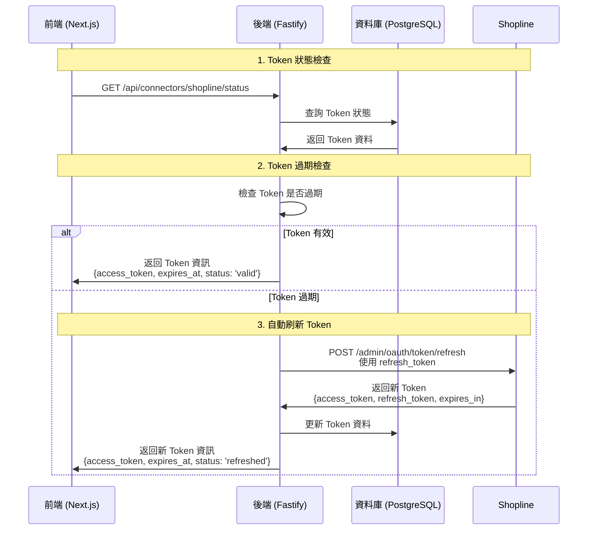
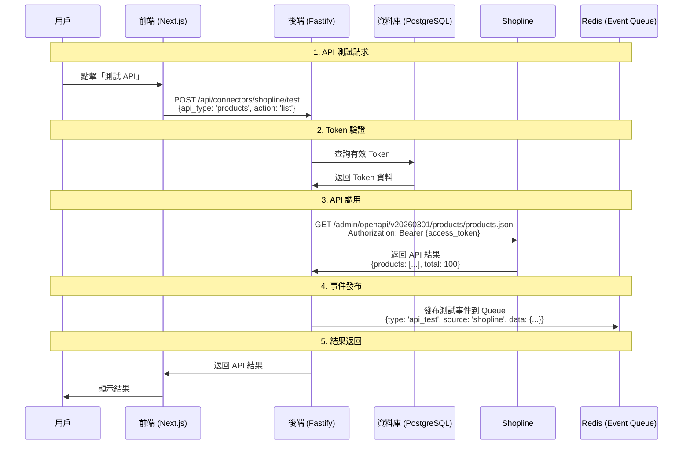
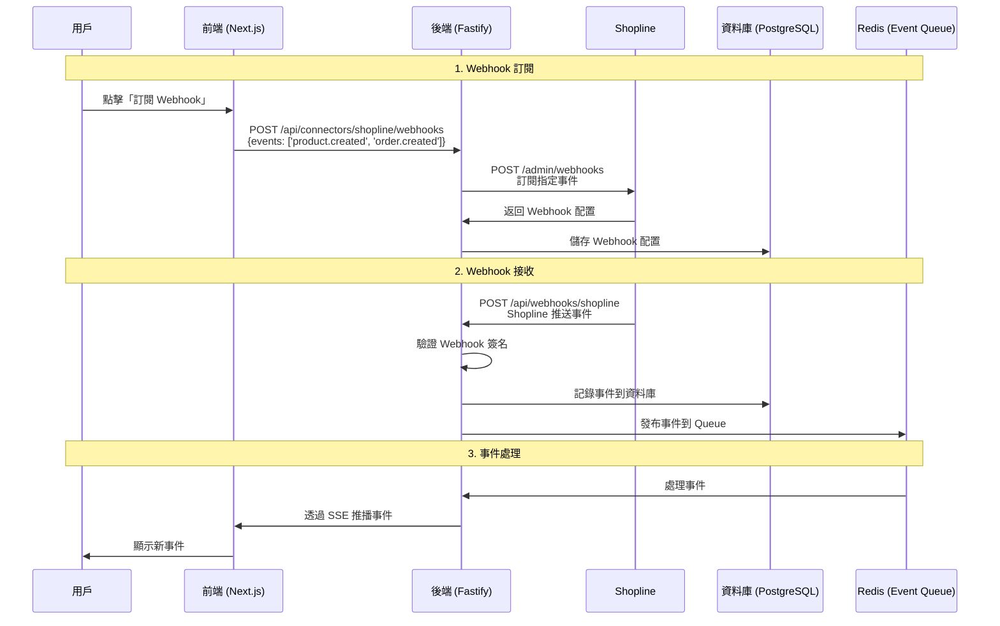
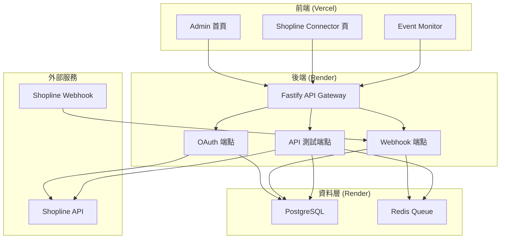
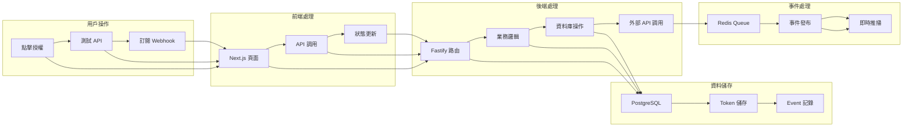
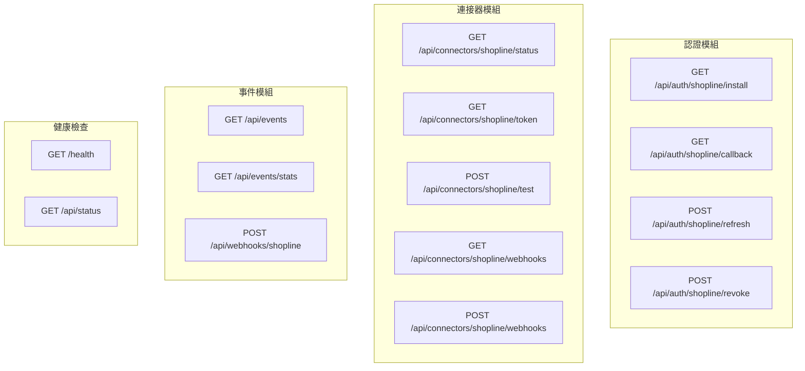
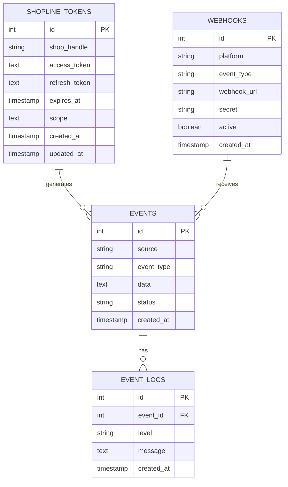
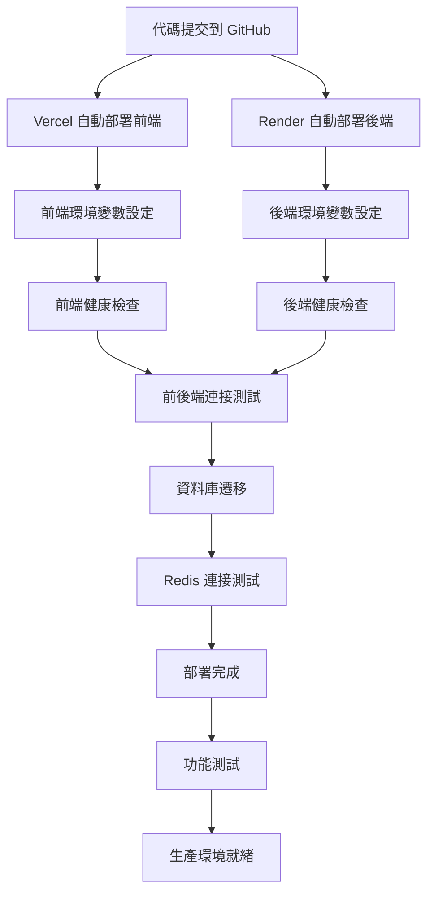

# OAuth 流程 Mermaid 圖表

**最後更新**: 2025-10-29  
**用途**: 視覺化展示 Shopline OAuth 2.0 完整流程

---

## 🔐 完整 OAuth 2.0 流程圖

### 1. 授權啟動與回調流程

### 2. Token 管理與刷新流程

### 3. API 測試與事件發布流程

### 4. Webhook 訂閱與接收流程

---

## 🏗️ 系統架構圖

### 前後端分離架構

### 資料流程圖

---

## 🔧 技術實作細節

### 1. 後端端點架構

### 2. 資料庫關聯圖

---

## 🚀 部署流程圖

### 完整部署流程

---

**最後更新**: 2025-10-29  
**維護者**: AI Assistant  
**版本**: 1.0.0
